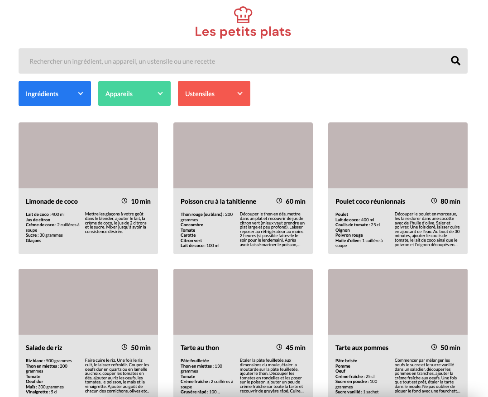

# Les Petits Plats

Les Petits Plats[^1] is a website containing their own recipes. To stand out from other recipe websites, the performance of the research feature is here the major work issue, with two wanted algorithms.

**Goal of this project**: Integration, fetch of JSON data, and performance comparison of 2 algorithms.


## Load specifications

### Website designs

The desktop designs are available on [Figma](https://www.figma.com/file/xqeE1ZKlHUWi2Efo8r73NK/UI-Design-Les-Petits-Plats-FR). The website is fully responsive for tablets and mobile.



### Features

- If user writes at least three characters in search bar, recipes are filtered by that string. Displayed recipes are updated with each newly typed character.
- Three dropdown lists are available for ingredients, apparels and utensils. User can search for an option by typing in each search field of dropdown lists (displayed options are updated when user is typing new characters).
- When an option in dropdown lists is clicked, the option is added as a research tag, and recipes are filtered by this tag.
- Several research tags can be selected, and shown recipes are the result of all tag filters (a recipe containing only one of the selected tags is not displayed).
- Search bar and research tags are combined, and displayed recipes result of the combination of those filters.

### Technical constraints

- No error or alert on W3C validators for HTML or CSS.
- No JavaScript library.
- Develop two research algorithms to compare their performances:
    * 1st algorithm (on `basic-version` branch) with native loops (`while`, `for`...).
    * 2nd algorithm (on `array-version` branch) with array methods (`foreach`, `filter`, `map`, `reduce`).


## Launch

### GitHub Pages

The page is available at <https://aurelianeg.github.io/lespetitsplats/> on GitHub Pages.

### Cloning

1. Clone the repository

```sh
git clone https://github.com/aurelianeg/lespetitsplats.git
```

2. Launch the project with Live Server

```sh
live-server
```

It opens the website to view it in the browser. The page will reload when changes are made in the code.


[^1]: This is the 5th project of the "Front-end developer (JS - React)" training by OpenClassrooms.